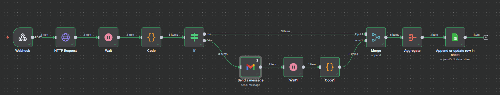
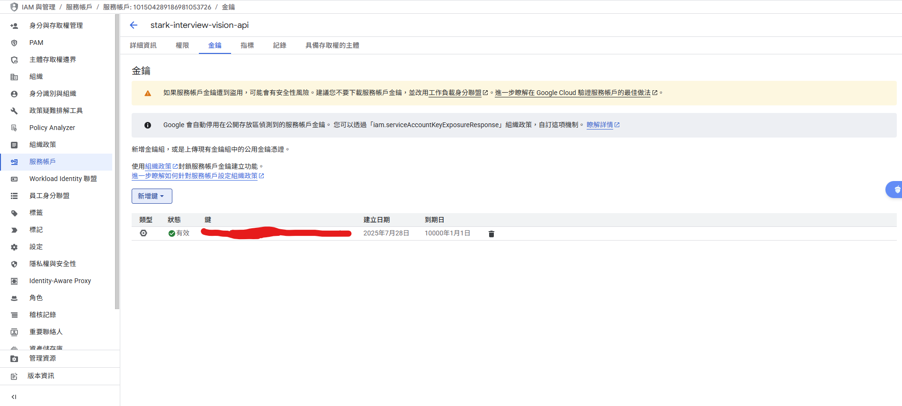
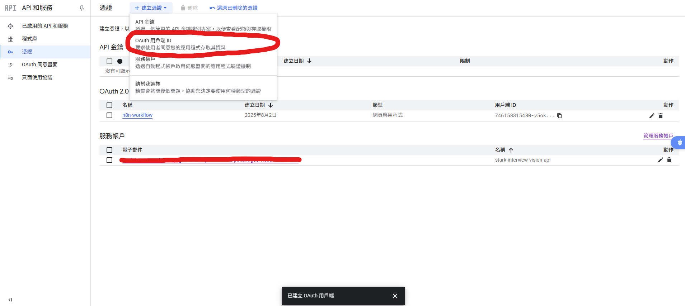
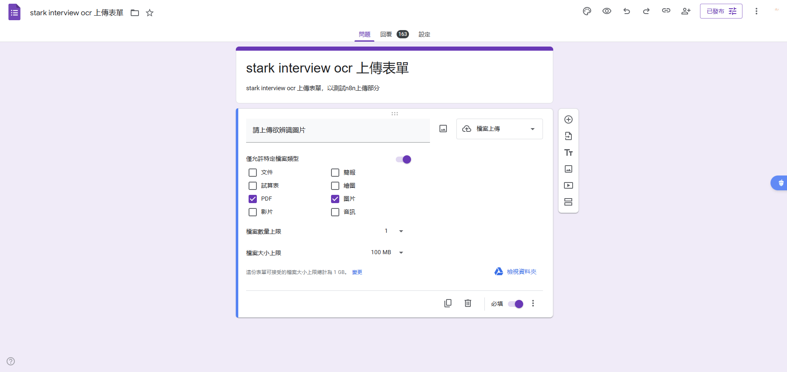
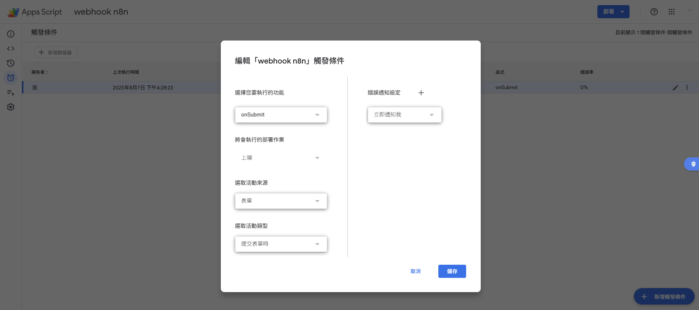
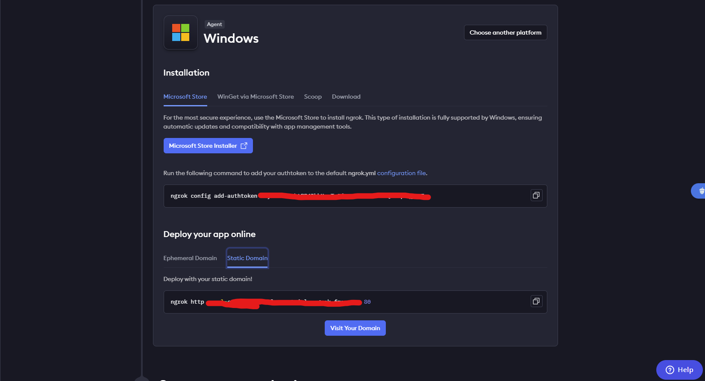
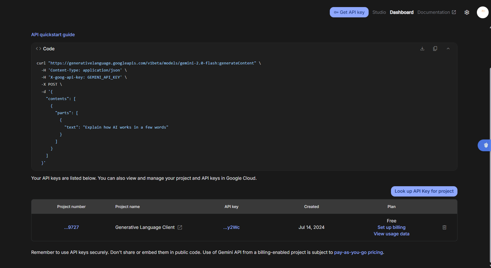
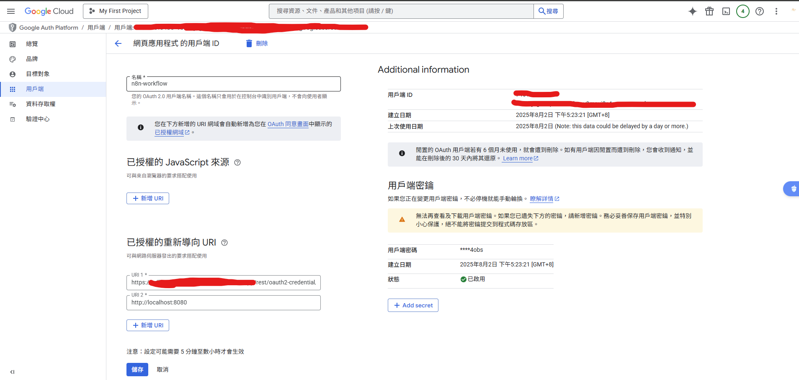
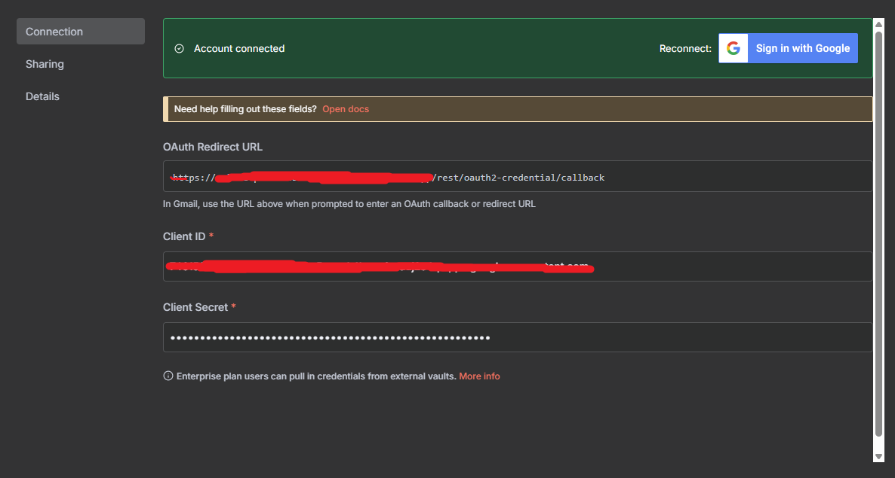

# OCR N8N 自動化處理流水線


本專案是基於 n8n 自動化的發票 OCR 處理流水線，具備 Google Drive 整合、OCR 處理和自動資料輸入至 Google Sheets 功能。



## 功能特色

- 📄 **OCR 處理**: 使用 Google Vision API 自動從圖片中提取文字
- 🔗 **N8N 整合**: 完整的工作流程自動化，支援 webhook
- 📊 **Google Sheets**: 自動資料輸入和追蹤
- 🤖 **AI 匹配**: 使用 Gemini AI 進行產品資料庫的模糊匹配
- 📧 **郵件提醒**: 低信心度評分通知
- 🐳 **Docker 支援**: 完整容器化部署
- 🌐 **Ngrok 整合**: 提供公開 webhook 端點用於測試

## 環境需求

在設置此專案之前，請確保您已安裝：

- [Docker](https://www.docker.com/get-started) 和 [Docker Compose](https://docs.docker.com/compose/install/)
- Python 3.9+ (用於本地開發)
- Git 版本控制工具

## 必要帳號申請

### 1. 建立 Service Account 及取得 OAuth json
*   在 [Google Cloud Console](https://console.cloud.google.com/) 中，前往 "IAM 和管理" -> "服務帳戶"。
*   建立服務帳戶並取得金鑰。
*   建立OAuth 2.0 用戶端 ID



### 2. Google Form 和 Apps Script 設定
1.  **建立 Google Form**:
    *   前往 [Google Forms](https://docs.google.com/forms/) 並建立一個新的表單。
    *   新增以下欄位：
        *   請上傳欲辨識圖片_urls (File Upload)
    *   取得表單的公開連結。
    *   
2.  **編寫 Google Apps Script**:
    *   在 Google Form 中，點擊右上角的「更多」選單（三個點），然後選擇「指令碼編輯器」。
    *   複製appscript.txt程式碼到 Apps Script 編輯器中
    *   將 `YOUR_WEBHOOK_URL` 替換為你的 N8N Webhook URL。
    *   儲存程式碼，並設定觸發器：
        *   點擊「觸發器」圖示（時鐘）。
        *   點擊「新增觸發器」。
        *   選擇「表單提交時」觸發。
        *   儲存觸發器。
    *   

### 3. Ngrok 帳號
1.  在 [ngrok.com](https://ngrok.com/) 註冊帳號
2.  從儀表板取得您的 authtoken
3.  取得免費版靜態網址URL
    

### 4. Google Gemini AI
1.  訪問 [Google AI Studio](https://aistudio.google.com/)
2.  建立 API 金鑰
3.  儲存 API 金鑰用於環境設定
    

### 5. Gmail 帳號
1.  使用現有的 Gmail 帳號或建立新帳號
2.  用於 N8N Gmail 整合，您需要設定 OAuth2 憑證：
    *   前往 [Google Cloud Console](https://console.cloud.google.com/)
    *   API 和服務 → 憑證
    *   為網頁應用程式建立 OAuth 2.0 用戶端 ID
    *   為 N8N 新增授權的重新導向 URL (Ngrok URL)
    *   亦為辨識錯誤手動調整業面新增重新導向 URL (localhost:8080)
        
    *   docker啟動後，設定OAuth2於Gmail send message n8n節點
        

### 6. Google Sheets
1.  建立新的 Google 試算表用於資料儲存
2.  將試算表與您的 GCP 服務帳戶電子郵件共用
3.  複製試算表 URL 用於環境設定
4.  將試算表調整於知道連結即可使用
5.  docker啟動後，設定OAuth2於google sheet n8n節點
    

### 7. .env設定
參照.env.example加入個設定金鑰、帳號、密碼，並改檔名為.env

## 安裝與設定

### 1. 複製專案

```bash
git clone <repository-url>
cd stark-interview

### 2. 啟動DOCKER
```bash
docker-compose up --build -d
```
